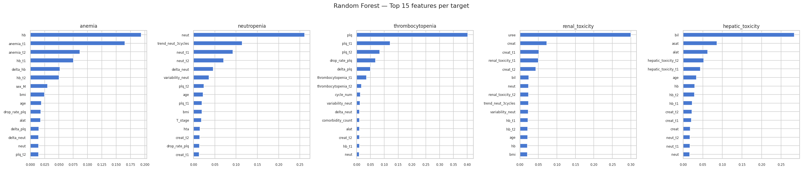

# OncoLab AI

**Predicting FOLFOX-induced biological complications in colorectal cancer patients using longitudinal machine learning**


Final Year Project in Pharmacy

- **Author and ML Engineer:** Zeroual Dhia Eddine
- **Clinical Supervisor:** Nadia Kerraouch

---

## Overview

OncoLab AI is a clinical decision support prototype that predicts **biological complications before the next cycle of FOLFOX chemotherapy** in patients treated for colorectal cancer.

For each cycle, the model combines the patient's current status **and** their recent history (laboratory results and complications from the previous 1–2 cycles) to output a probability for each of five complications:

| Complication | Prevalence in the dataset |
|---|---|
| Anaemia | 68.0 % |
| Hepatic toxicity | 28.6 % |
| Thrombocytopenia | 17.9 % |
| Renal toxicity | 9.1 % |
| Neutropenia | 5.1 % |

The goal is not to replace the oncologist's judgement, but to flag high-risk patients early so that doses can be adapted and unscheduled hospitalisations avoided.

### Headline result

On a fully isolated test set of **22 unseen patients (141 cycles)**, the soft-voting ensemble reaches a **mean AUC-ROC of 0.983** across the five complications.

---

## Why longitudinal features?

A single laboratory value is a weak predictor. A neutrophil count of 2.0 G/L means something very different if it has been **stable** for three cycles or if it **dropped by 8.0** at the previous cycle.

This project encodes each patient's trajectory as concrete numerical features:

| Feature family | Examples | What it captures |
|---|---|---|
| Current biomarkers | `hb`, `neut`, `plq`, `creat`, … | Snapshot of the patient's current state |
| Lagged biomarkers | `hb_t1`, `neut_t2`, … | Where the patient stood 1–2 cycles ago |
| Delta features | `delta_hb`, `delta_plq` | Speed and direction of change |
| Trend features | `trend_neut_3cycles`, `drop_rate_plq`, `variability_neut` | Multi-cycle dynamics |
| Prior complications | `anemia_t1`, `neutropenia_t1`, … | Has this complication already occurred? |

All features are computed strictly within each patient's chronological history, so no information from future cycles is ever used.

---

## Dataset

The raw data were collected manually from patient records at a single oncology centre and provided by the clinical team.

| Stage | Rows | Patients |
|---|---|---|
| Raw CSV (French headers, European decimals) | 947 | 110 |
| After cleaning and de-duplication | 921 | — |
| Final longitudinal dataset (rows without 2-cycle history removed) | **704** | **108** |

The final dataset contains **59 columns** (the patient identifier, the model features and the 5 targets). Every column is documented in [`data/data_dictionary.md`](data/data_dictionary.md).

**Main data preparation steps** (fully documented in `notebooks/1_data_preparation.ipynb`):

- French column names renamed to English `snake_case`; European decimal commas converted to points
- Structured strings parsed into numeric columns (`Cure` → `cycle_num`, `Intervalle` → `interval_days`, `Stade` → `T_stage` / `N_stage` / `M_stage`)
- Categorical variables normalised (case and spelling inconsistencies)
- Patient ID case fixed (`p16` → `P16`)
- Data entry errors corrected (corrupted TNM string for patient P31, stage label without M digit for patient P107, a decimal-point error in `uree`)
- Unit correction for platelets and neutrophils (cells/µL → G/L)
- Rescheduled-cycle duplicates resolved by keeping the administered cycle (26 rows removed across 20 patients)

---

## Methodology

**Problem formulation.** Five independent binary classification tasks, one per complication.

**Leakage prevention.** Two common sources of over-optimistic results are explicitly eliminated:

- *Patient-level leakage:* every split uses `GroupShuffleSplit` / `GroupKFold` on the patient identifier, so no patient appears in both training and validation/test data.
- *Feature-scaling leakage:* `StandardScaler` is fitted **inside each cross-validation fold**, on the fold's training rows only.

**Validation strategy.**

1. Patient-level 80/20 split → training set (86 patients, 563 cycles) and an isolated test set (22 patients, 141 cycles)
2. 5-fold `GroupKFold` cross-validation on the training set for model selection
3. The test set is evaluated **once**, at the end, and never used for any selection

**Models.** Random Forest, Extra Trees, XGBoost and LightGBM, with class weighting to handle imbalance.

**Ensemble.** Soft voting (average of predicted probabilities) of the three models with the best mean cross-validation AUC-ROC: XGBoost (0.9767), LightGBM (0.9756) and Random Forest (0.9750). Extra Trees (0.938) was excluded.

---

## Results

Performance of the ensemble on the isolated test set (22 patients, 141 cycles), threshold = 0.50:

| Complication | AUC-ROC | Sensitivity | Specificity | PPV | F1 |
|---|---|---|---|---|---|
| Anaemia | **0.995** | 1.00 | 0.89 | 0.94 | 0.97 |
| Neutropenia | **0.954** | 0.50 | 1.00 | 1.00 | 0.67 |
| Thrombocytopenia | **0.993** | 1.00 | 0.98 | 0.88 | 0.94 |
| Renal toxicity | **0.999** | 0.91 | 1.00 | 1.00 | 0.95 |
| Hepatic toxicity | **0.972** | 0.95 | 0.99 | 0.98 | 0.97 |
| **Mean** | **0.983** | **0.87** | **0.97** | **0.96** | **0.90** |

- The **prior-complication indicators** (`*_t1`) and **lagged biomarkers** are the most informative features for all five targets, which supports the longitudinal approach.
- Neutropenia has only 4 positive cycles in the test set, so its sensitivity (2 of 4 detected) is the most fragile metric. The high AUC indicates strong discrimination; the 0.50 threshold is conservative given the class imbalance.
- Per-patient predictions for every test cycle are available in [`outputs/per_patient_predictions.csv`](outputs/per_patient_predictions.csv) for clinical verification.



---

## Project structure

```
oncolab-ai/
├── data/
│   ├── raw/
│   │   └── Collect Data Onco Lab AI - Feuille 2.csv   # Original CSV from the clinical team (unmodified)
│   ├── dataset_longitudinal.csv                       # Final ML-ready dataset (704 rows × 59 columns, 108 patients)
│   └── data_dictionary.md                             # Column-by-column documentation
├── models/                                            # Trained models (.pkl) — 3 models × 5 targets
├── notebooks/
│   ├── 1_data_preparation.ipynb                       # Raw data → longitudinal dataset (full pipeline)
│   └── 2_model_longitudinal.ipynb                     # EDA, training and evaluation
├── outputs/
│   ├── feature_importance_longitudinal.png
│   └── per_patient_predictions.csv                    # Test-set predictions for clinical verification
├── report/
│   ├── report_en.tex                                  # Full report (LaTeX, English)
│   ├── report_fr.tex                                  # Full report (LaTeX, French)
│   └── report_fr.pdf                                  # Full report (PDF, French)
├── demo.py                                            # Interactive demo (opens in the browser)
├── README.md
└── requirements.txt
```

---

## Getting started

### Prerequisites

Python 3.12 and the packages listed in `requirements.txt` (pandas, NumPy, scikit-learn, XGBoost, LightGBM, joblib, matplotlib, seaborn, Jupyter).

```bash
git clone https://github.com/<your-username>/<repo-name>.git
cd <repo-name>
pip install -r requirements.txt
```

### Reproduce the full pipeline

```bash
# 1. Build the longitudinal dataset from the raw CSV
jupyter nbconvert --to notebook --execute --inplace notebooks/1_data_preparation.ipynb

# 2. Train and evaluate the models
jupyter nbconvert --to notebook --execute --inplace notebooks/2_model_longitudinal.ipynb
```

Each notebook is self-contained and includes:

- Markdown cells documenting every step
- Exploratory data analysis with visualisations
- Documented preprocessing decisions
- Leakage-free cross-validation (`GroupKFold` on patient IDs, per-fold scaling)
- A soft-voting ensemble of the 3 best models (XGBoost + LightGBM + Random Forest)
- Evaluation on an isolated test set of 22 unseen patients

### Run the demo

```bash
python3 demo.py
```

This opens the interactive demo in your web browser, where you can try the model yourself.

### Build the report (optional)

```bash
cd report
pdflatex report_en.tex   # run twice to resolve cross-references
```

---

## Proposed clinical usage

1. **Eligibility:** the patient must have completed at least 2 previous cycles (needed to compute the lagged history).
2. **Inputs:** static demographics, comorbidities, TNM staging, current biomarkers, dose, and recent cycle history.
3. **Output:** one probability per complication, plus a yes/no flag at the 0.50 threshold.
4. **Action:** flagged patients warrant closer monitoring or a dose adjustment before the next cycle.

> **Disclaimer:** this project is a research and educational prototype. It has not been validated prospectively and must not be used to make clinical decisions.

---

## Limitations

- **Single-centre data** with only 108 patients — no external validation
- **Retrospective study** — a prospective trial is required before any clinical use
- Complication **severity (grade I–IV) is not modelled**, only presence/absence
- Neutropenia has a prevalence of only ~5.1 %, so sensitivity is the most fragile metric for that target
- The model needs ≥ 2 cycles of history, so it **cannot be applied to a patient's first two cycles**
- ~20 rows with suspicious creatinine values were kept pending clinical confirmation

---

## Data availability and ethics

The patient data are anonymised and are shared publicly with the permission of the clinical team that provided them. The dataset was collected retrospectively at a single centre for academic purposes as part of this final year project.

---

## License

The source code and notebooks in this repository are released under the [MIT License](LICENSE). The data are covered by the statement in the section above.

---

## Report

The full report (clinical background, data pipeline, methodology, results and discussion) is available in this repository:

- English: [`report/report_en.pdf`](report/report_en.pdf) (compiled) and [`report/report_en.tex`](report/report_en.tex)
- French: [`report/report_fr.pdf`](report/report_fr.pdf) (compiled) and [`report/report_fr.tex`](report/report_fr.tex) (source)

The FOLFOX protocol references are listed in the report (Chapter 2, Clinical and Technical Background).

---

## Documentation

- [`data/data_dictionary.md`](data/data_dictionary.md) — column-by-column documentation
